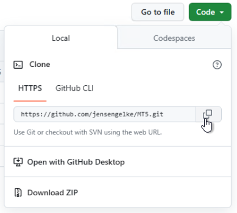
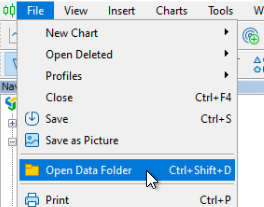
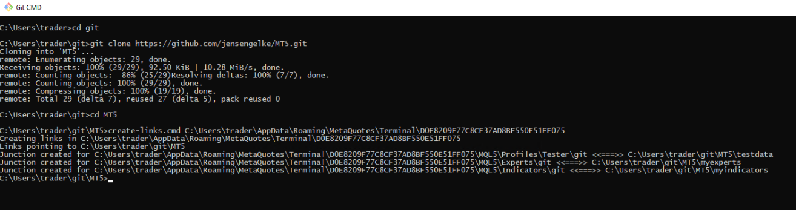

# Setup
1. Install [Git CLI](https://git-scm.com/download/win) (`64bit Git for Windows Setup`). Accept all default settings
1. Get the repository URL
    - Visit https://github.com/jensengelke/MT5
    - Click on "Code" 
    - Copy the URL 
1. With Git CLI installed, run
    ```bash
    git clone https://github.com/jensengelke/MT5.git
    cd MT5
    ```
1. Determine date folder path
    - In MT5, click `Open Data Folder` 
    - Click the directory location and copy 
1. Create directory links
    ```bash
    create-links.cmd <data folder path>
    ```
    


